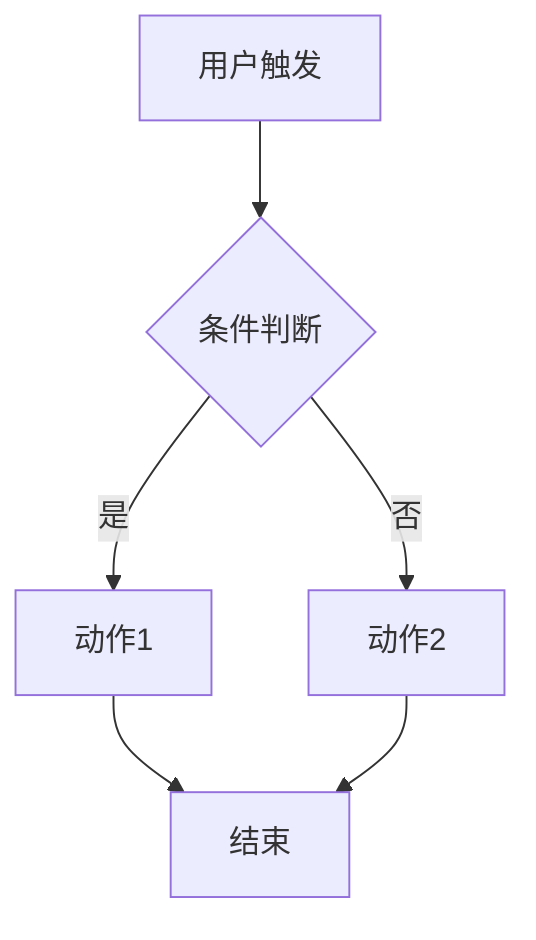
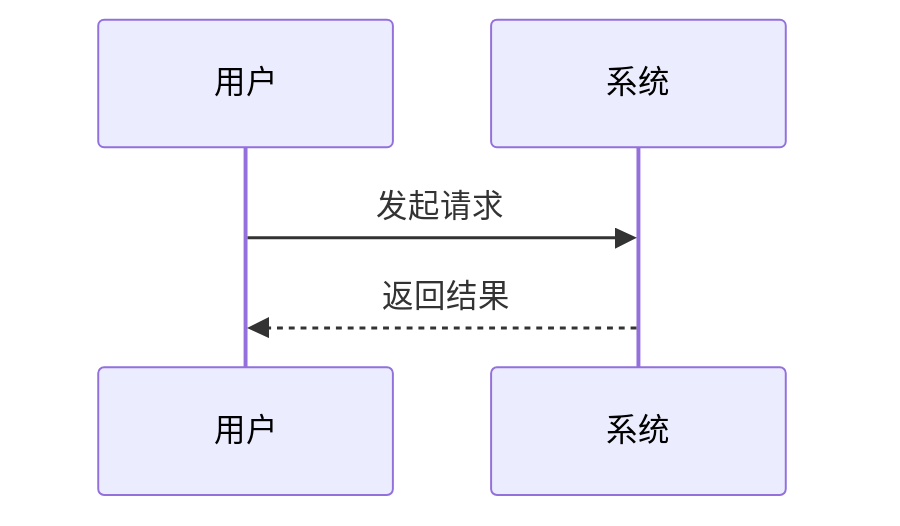
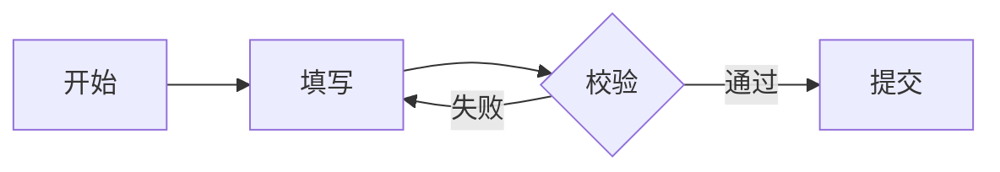

# 业务流程与场景流程图模板

> 用法：在 PRD §5 使用。要求三类可视图，均用 Mermaid 文本（可渲染、可 diff）。
> 覆盖"各种场景 + 各种操作"。

## 一、整体业务流程图

## 二、场景流程图（按主/次/异常分别画）
### 主场景

### 异常场景
- 标注：异常触发条件、系统提示、用户应对、回滚路径

## 三、操作流程图（每个核心操作一张）

## 输出要求
- 整体流程图：端到端主链路
- 每个场景：主流程 + 至少 1 条异常流程
- 每个操作：操作步骤 + 校验/分支 + 失败处理
