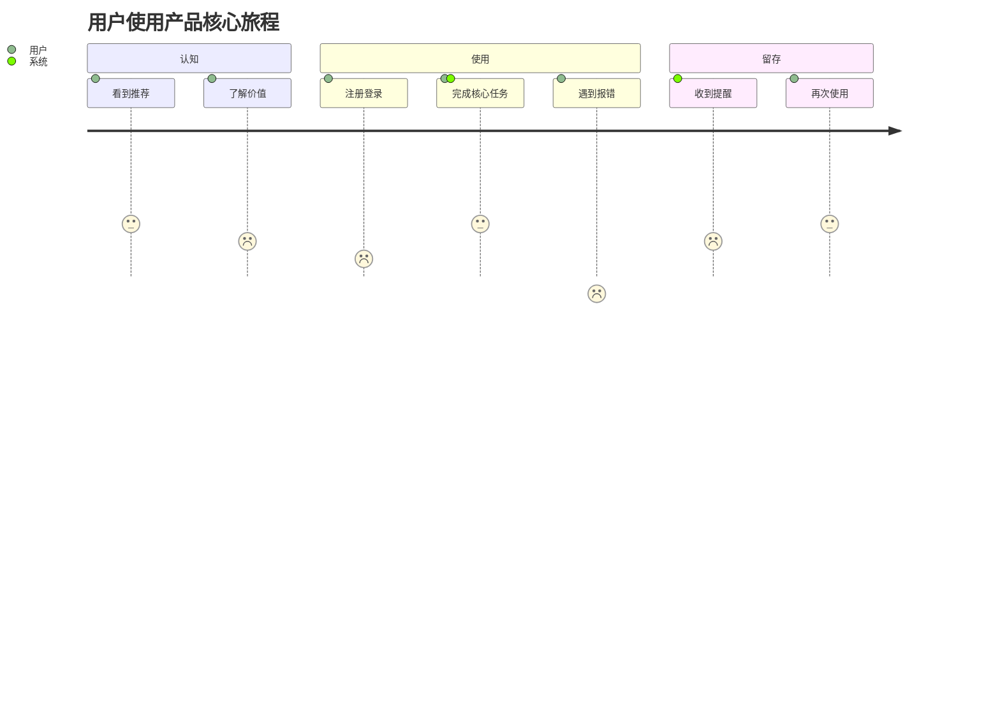

# 用户旅程图模板

> 用法：在 ④ 场景梳理后生成，作为"搭建阶段起点"产出，与用户故事地图一并经确认门 1 确认。
> 用 Mermaid 文本描述，便于版本管理与 diff。

## 结构
| 阶段 | 用户目标 | 触点/渠道 | 用户动作 | 情绪（-2~-+2） | 痛点 | 机会点 |
|------|---------|----------|---------|--------------|------|--------|
| 认知 | ... | ... | ... | +1 | ... | ... |
| 考虑 | ... | ... | ... | 0 | ... | ... |
| 使用 | ... | ... | ... | +2 | ... | ... |
| 留存 | ... | ... | ... | -1 | ... | ... |
| 推荐 | ... | ... | ... | +1 | ... | ... |

## Mermaid 旅程图示例

## 输出要求
- 覆盖全部核心 persona 的主旅程
- 标注情绪曲线峰值与低谷（对应痛点）
- 每个痛点给出"机会点"（后续功能可承接）
