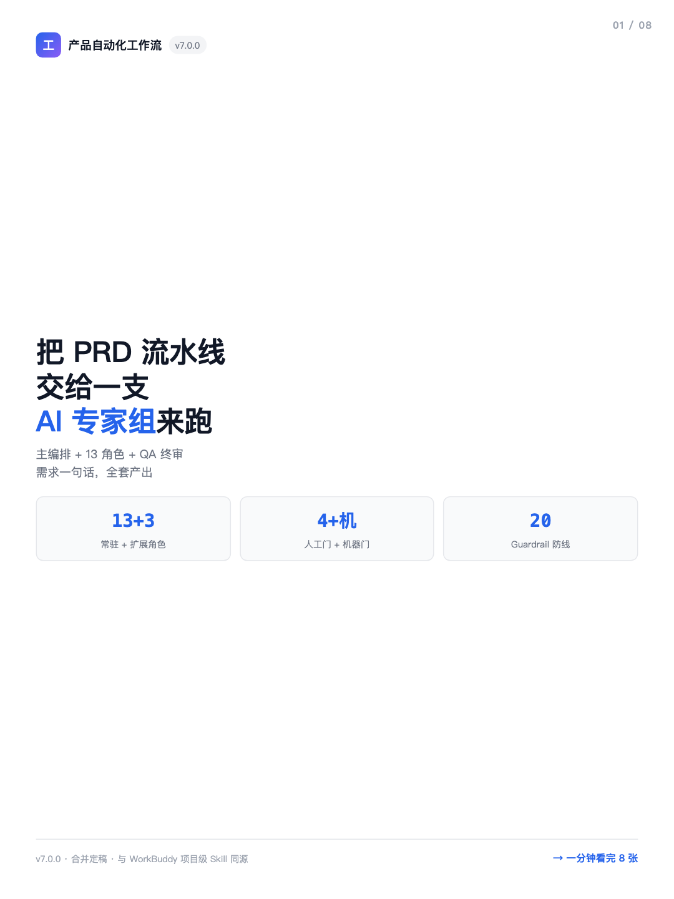
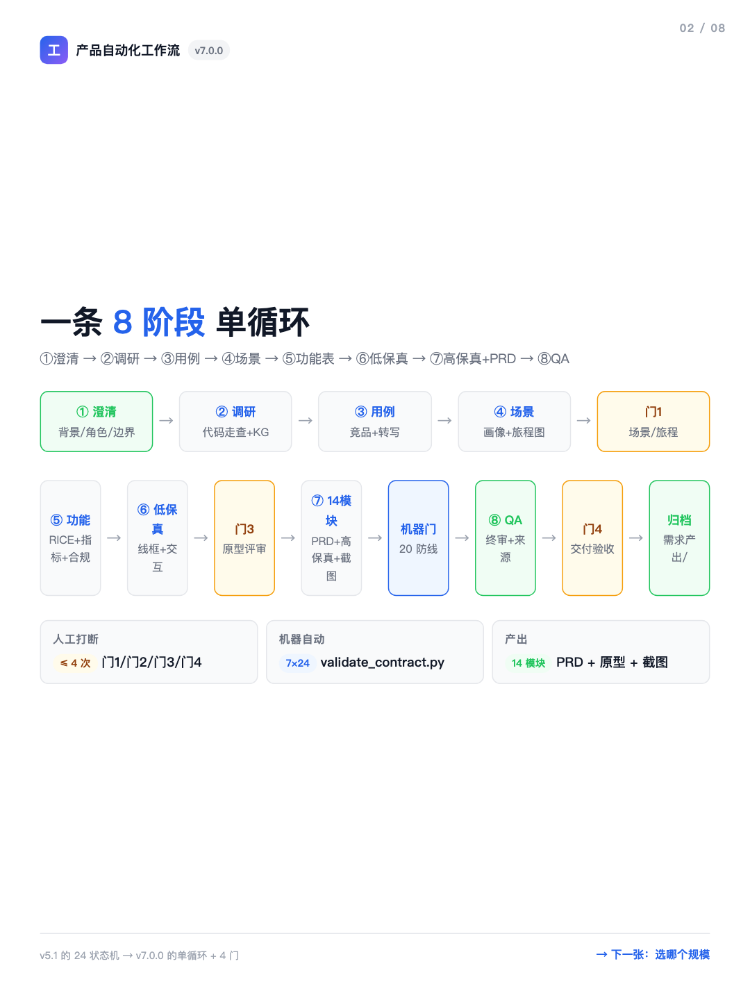
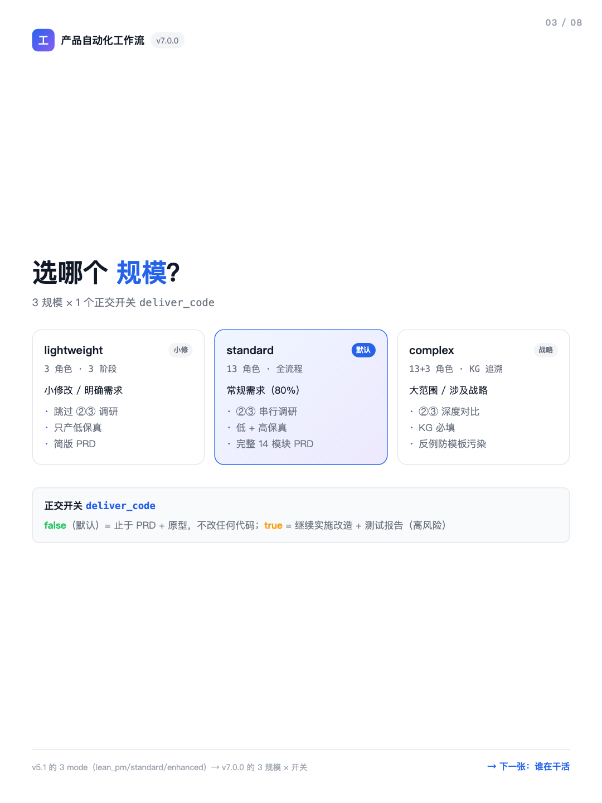
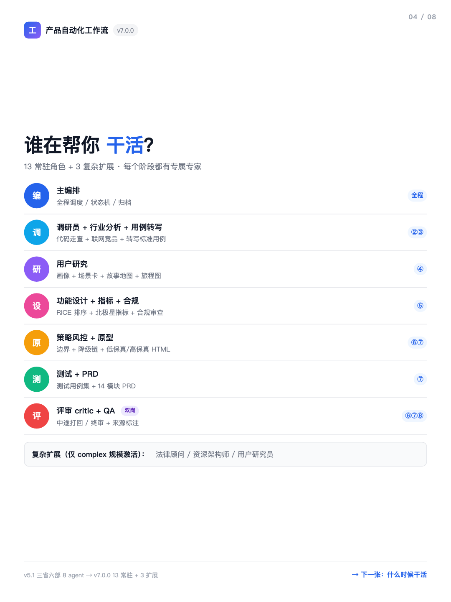
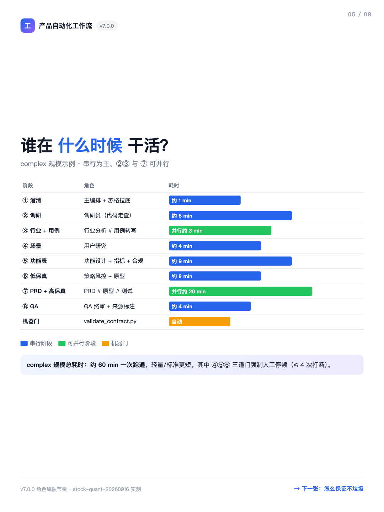
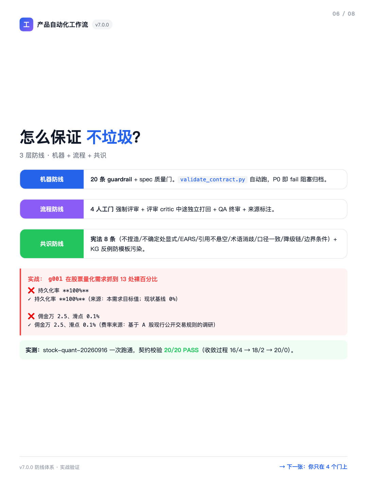
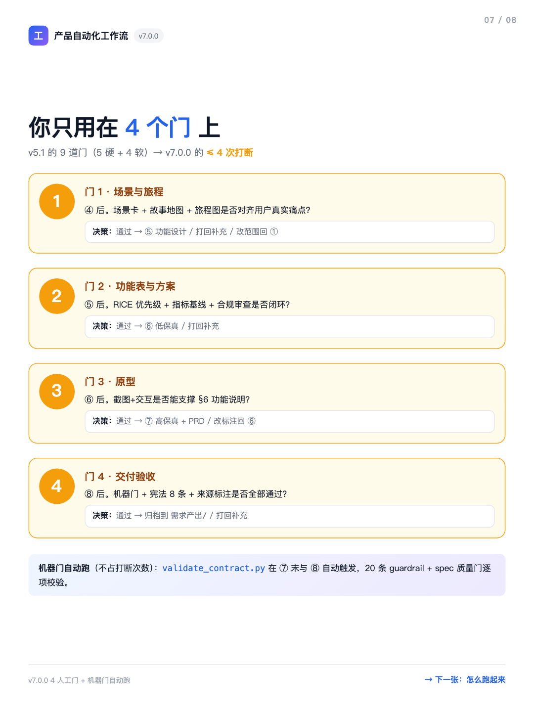
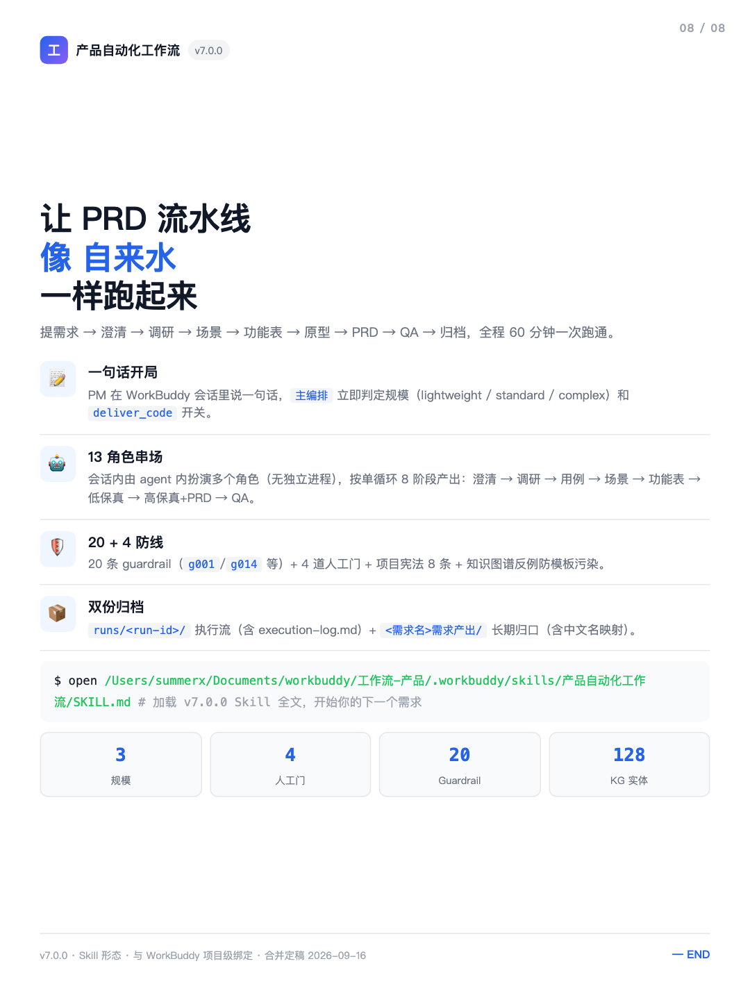

# 产品自动化工作流（Product Automation Workflow）

> 一句话需求 → PRD + 高保真原型 + 截图 · Skill 形态 · 单循环 8 阶段 · 13 常驻角色 + 3 复杂扩展

[](CHANGELOG.md)
[](LICENSE)
[](docs/FLOW_DIAGRAM.md)
[](contracts/constitution.yaml)
[](knowledge_graph/index.jsonl)

让 PRD 流水线**像自来水一样跑起来**：一句话开局、13 角色串场、20 条机器防线自动把关、4 道人工门拍板，全程 **60 分钟**一次跑通。

---

## 一、八张卡片速览

> 这是一份**可发布版本**的纯工作流本体（不包含你跑出来的需求文档）。
> 完整说明见 [docs/FLOW_DIAGRAM.md](docs/FLOW_DIAGRAM.md)、[docs/cards/](docs/cards/)。

| # | 主题 | 预览 |
|:--:|---|---|
| 1 | 封面 · 13 角色 + 4 门 + 20 防线 |  |
| 2 | 一条 8 阶段单循环 |  |
| 3 | 选哪个规模 + `deliver_code` 开关 |  |
| 4 | 谁在干活（13 角色编队） |  |
| 5 | 谁在什么时候干活（介入矩阵） |  |
| 6 | 怎么保证不垃圾（3 层防线） |  |
| 7 | 你只用在 4 个门上 |  |
| 8 | 像自来水一样跑起来 |  |

桌面端长版：[docs/workflow_guide.html](docs/workflow_guide.html) · 移动端：[docs/workflow_guide_h5.html](docs/workflow_guide_h5.html)

---

## 二、它是什么

**产品自动化工作流**是一套面向 PM 的 Skill 形态工作流，能把「一句话需求」自动转成
**14 模块 PRD + 高保真可交互原型 + 测试用例集 + 来源标注**，全过程在 **WorkBuddy 会话内**
由 agent 扮演多个角色完成，**无独立进程、无 MCP spawn**。

- **形态**：WorkBuddy 项目级 Skill（`.workbuddy/skills/产品自动化工作流/`）
- **运行主体**：单一 WorkBuddy 会话内的 agent 内扮演多角色
- **语言**：Python 3.13（managed）+ Node 22（managed） + 系统 Google Chrome

---

## 三、核心特性

### 3.1 单循环 8 阶段（v5.1 的 24 状态机 → v7.0.0 的单循环）

```
① 澄清 → ② 调研 → ③ 用例 → ④ 场景 → 【门 1】→ ⑤ 功能表 → 【门 2】→
⑥ 低保真 → 【门 3】→ ⑦ 高保真+PRD → 【机器门】→ ⑧ QA → 【门 4】→ 归档
```

### 3.2 3 规模 × 1 正交开关

| 规模 | 角色数 | 适用 |
|---|---|---|
| **lightweight** | 3 | 小修改 / 明确需求 |
| **standard**（默认） | 13 | 常规需求 |
| **complex** | 13 + 3 扩展 | 大范围 / 涉及战略 |

**`deliver_code` 开关**：`false`（默认）= 止于 PRD + 原型，**不改代码**；
`true` = 继续实施改造（高风险）。

### 3.3 4 人工门 + 机器门自动跑（≤4 次打断）

- **门 1** 场景与旅程 / **门 2** 功能表与方案 / **门 3** 原型 / **门 4** 交付验收
- 机器门 `validate_contract.py` 自动触发，**不占打断次数**

### 3.4 20 条 Guardrail + 8 条宪法 + KG 反例

- **g001 数据要有来源**（无来源声明的百分比自动 fail）
- **g014 KG 反例**（standard/complex 必填，至少 1 条 `role: counter_example` 防模板污染）
- 项目宪法 8 条 + spec 质量门 6 条，**机器 + 流程 + 共识** 3 层防线

---

## 四、与使用场景对比

| 维度 | v5.1 / v6.0（独立 CLI） | **v7.0.0（本仓库）** |
|---|---|---|
| 形态 | 独立工具 + 状态机 | Skill 形态（项目级） |
| 角色 | 三省六部 8 agent | **13 常驻 + 复杂 3 扩展** |
| 流程 | 3 mode × 24 态 | **单循环 + 3 规模 × 开关** |
| 门 | 5 硬 + 4 软（9 道打断） | **4 人工门 + 机器门** |
| Guardrail | 19 | **20**（实战验证有效） |
| KG 实体 | 22 | **128** |

详见 [docs/WORKFLOW_BENCHMARK.md](docs/WORKFLOW_BENCHMARK.md) 与 GitHub 主流框架横向对比。

---

## 五、快速上手

### 5.1 准备工作

```bash
# 受管运行时（已预装）
# Python 3.13.12 + Node 22.22.2 + 系统 Google Chrome

# Python 依赖（运行机器门）
PY=$HOME/.workbuddy/binaries/python/envs/default/bin/python
$PY -m pip install pyyaml

# Node 依赖（截图脚本）
NODE_PATH=$HOME/.workbuddy/binaries/node/workspace/node_modules
```

### 5.2 加载 Skill

在 WorkBuddy 项目根目录下：

```bash
# 工作流 Skill 已在 .workbuddy/skills/产品自动化工作流/
# 让 WorkBuddy 加载它即可使用
```

### 5.3 提出需求

直接在 WorkBuddy 会话里说一句话：

```
提需求：做一个示例交易系统的 MVP
```

主编排会立即：
1. 判定规模（lightweight / standard / complex）
2. 询问 `deliver_code` 开关
3. 自动推进 8 阶段，跑完后输出 PRD + 高保真原型 + 截图

### 5.4 查看产出

```
工作流-产品/
├── <需求名>需求产出/           # 中文名映射的可见交付物
├── runs/<run-id>/              # 执行流（含 execution-log.md）
└── docs/cards/                 # 8 张小红书卡片预览
```

---

## 六、目录结构

```
pm-workflow/
├── .workbuddy/skills/产品自动化工作流/   ← Skill 本体（145 文件）
│   ├── SKILL.md                         ← 主入口
│   ├── scripts/                        ← 26 个脚本（self_check / validate_contract / gen_screenshots / ...）
│   ├── references/                     ← 角色 / 工作流 / 模板
│   └── runs/                           ← 执行留痕样例（self-check）
├── contracts/                          ← 契约（15 文件）
│   ├── constitution.yaml               ← 项目宪法 8 条
│   ├── design_tokens.yaml              ← 设计系统 token
│   ├── spec_checklist.yaml             ← spec 质量门
│   └── schema/                         ← agent / guardrail / kg 契约
├── knowledge_graph/                    ← 知识图谱（49 文件 / 128 实体）
├── docs/                               ← 用户文档
│   ├── FLOW_DIAGRAM.md                 ← 主流程图（mermaid）
│   ├── KG_GUIDE.md                    ← 知识图谱指南
│   ├── WORKFLOW_BENCHMARK.md          ← 对标 BMAD/Spec Kit/Kiro 等
│   ├── workflow_guide.html / _h5.html ← 桌面 + 移动端使用指南
│   ├── cards/card-1~8.html            ← 8 张小红书卡片 HTML
│   └── screenshots/card-1~8.png       ← 8 张 PNG 出图（1080×1440）
├── requirements.txt                    ← Python 依赖
├── LICENSE                             ← MIT 许可
└── CONTRIBUTING.md                     ← 贡献指南
```

---

## 七、依赖

### 7.1 运行时（已预装，无需安装）

| 组件 | 版本 | 用途 |
|---|---|---|
| Python | 3.13.12（managed） | 校验 / 知识图谱 / 状态机 |
| Node | 22.22.2（managed） | puppeteer-core 截图脚本 |
| Google Chrome | 系统最新版 | headless 截图渲染 |
| 工作流宿主 | WorkBuddy 桌面端 | Skill 加载 / 会话调度 |

### 7.2 Python 依赖（见 `requirements.txt`）

```
PyYAML>=6.0      # validate_contract / kg 校验
```

### 7.3 Node 依赖（受管 workspace）

```
puppeteer-core   # 截图（无需下载 Chromium，指向系统 Chrome）
```

---

## 八、资产来源与致谢

本项目**仅发布工作流本体**（Skill + 契约 + 知识图谱 + 文档），
不包含运行产出的需求文档。

- **小红书卡片设计**（`docs/cards/card-*.html`）：本工作区原创，卡片样式参考自 8 张（编号固定）的小红书发布卡片规范（750×1000 CSS px → 1080×1440 设备像素 @3:4）
- **本工作区演化样本**：本仓库**不携带**任何来自参考项目的具体内容（不复用其代码、文档、用户数据）
- **历史归档**（v5.1/v6.0 来源于姊妹工作流仓库仓库，合并于 2026-09-16）：仅保留在本仓库姊妹项目，不在本发布仓

---

## 九、许可

[MIT](LICENSE) © 2026 pm-workflow Contributors

---

## 十、致谢

- **BMAD Method**（单循环 + 三入口模式）
- **GitHub Spec Kit**（checklist 思路）
- **Kiro**（EARS 句式）
- **Task Master**（复杂度分析思路）

完整对标报告：[docs/WORKFLOW_BENCHMARK.md](docs/WORKFLOW_BENCHMARK.md)