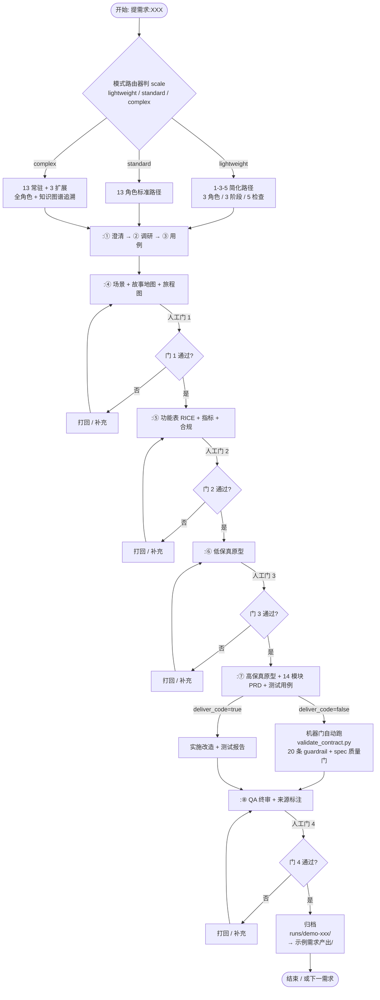

# Pm Workflow · 流程图（v7.0.0）

> **路径**：`<workspace>/`（项目工作区 + 项目级 Skill）
> **形态**：Skill 形态（`.workbuddy/skills/pm-workflow/SKILL.md`），不是独立系统、不是插件
> **版本**：v7.0.0（2026-09-16 · 合并两套工作流后定稿）
> **来源**：原 示例仓库 `docs/FLOW_DIAGRAM.md`（v5.1/v6.0，三省六部·24 状态·lean_pm/standard/enhanced）已废弃——本文件为合并版
> **执行主体**：单一 WorkBuddy 会话内由 agent 扮演多个角色（无独立进程、无 MCP spawn）

---

## 一、一句话用起来：从一句话需求到 PRD + 高保真原型 + 截图



---

## 二、模式路由器（3 规模 × deliver_code 开关）

> v5.1 的「3 个 mode（lean_pm/standard/enhanced）」已被取代为**「3 规模 × 1 个正交开关 `deliver_code`」**。

| 规模 | 适用场景 | 角色数 | 调研深度 | 原型 | 产出 |
|---|---|---|---|---|---|
| **lightweight** | 小修改 / 明确需求 | 3 角色 | 跳过 ②③ | 低保真即可 | 简版 PRD |
| **standard** | 常规需求 | 13 常驻 | ②③ 串行 | 低保真+高保真 | 完整 PRD |
| **complex** | 大范围 / 涉及战略 | 13 常驻 + 3 扩展 | ②③ 深度对比 + KG 追溯 | 同上 | 同上 + KG refs |

**`deliver_code` 开关（正交）**：
- `false`（默认）：止于 ⑦ 高保真 + PRD + 测试用例，**不改动任何代码**——本轮示例即此模式。
- `true`：⑦ 后继续实施改造 + 测试报告，会真实改动参考项目代码——属于高风险操作。

判定信号（模式路由器取其一即可）：
- 涉及战略 / 多团队 / 重构 → **complex**
- 明确范围 + 标准流程 → **standard**
- 小修改 / 单点优化 → **lightweight**

---

## 三、13 常驻角色 + 3 复杂扩展

### 3.1 角色表

| 角色 | 主产出 | 阶段 | lightweight | standard | complex |
|---|---|---|:---:|:---:|:---:|
| 主编排 | 任务调度 + 状态机 + 归档 | 全程 | ✓ | ✓ | ✓ |
| 调研员 | 现状盘点（以代码走查为准） | ② | 简化 | ✓ | ✓ |
| 行业分析 | 联网竞品调研 | ③ | — | ✓ | ✓ |
| 用例转写 | 调研结论 → 标准用例 | ③ | — | ✓ | ✓ |
| 用户研究 | 画像 + 场景卡 | ④ | 简化 | ✓ | ✓ |
| 功能设计 | RICE 功能表 | ⑤ | ✓ | ✓ | ✓ |
| 指标 | 北极星 + 过程指标 | ⑤ | — | ✓ | ✓ |
| 合规 | 合规审查 + 免责 | ⑤ | — | ✓ | ✓ |
| 策略与风控 | 边界条件 + 降级链 | ⑥ | ✓ | ✓ | ✓ |
| 原型 | 低保真 + 高保真 | ⑥⑦ | 低保真 | ✓ | ✓ |
| 测试 | 测试用例集 | ⑦ | ✓ | ✓ | ✓ |
| PRD | 14 模块 PRD | ⑦ | ✓ | ✓ | ✓ |
| 评审 critic | 中途独立打回（reviewer） | ⑥⑦ | — | ✓ | ✓ |
| **QA** | 终审 + 来源标注 | ⑧ | ✓ | ✓ | ✓ |
| *(复杂+)* 法律顾问 | 深度合规 / 跨境 / 数据授权 | ⑤ | — | — | ✓ |
| *(复杂+)* 用户研究员 | 实地访谈 / 可用性测试 | ④ | — | — | ✓ |
| *(复杂+)* 资深架构师 | 技术债务评估 / 重构方案 | ⑤ | — | — | ✓ |

> **易混淆的分工**（不合并）：`评审 critic`（中途独立打回）≠ `QA`（终审 + 来源标注）。

### 3.2 一图看清谁在什么时候干活

```mermaid
gantt
    title 13+3 角色 编队节奏（complex 规模示例）
    dateFormat  HH:mm
    axisFormat  %H:%M

    section 主编排
    调度+状态+归档    :crit, m0, 00:00, 60m

    section 调研
    调研员(背景走查)   :a1, 00:01, 6m
    行业分析(联网)    :a2, 00:02, 3m
    用例转写          :a3, after a2, 2m

    section 设计
    用户研究          :a5, after a3, 4m
    功能设计 RICE     :a6, after a5, 5m
    指标+合规          :a7, 00:07, 4m

    section 原型
    策略风控           :a8, 00:09, 2m
    原型(低保真→高保真) :a9, after a8, 8m

    section 测试与交付
    测试用例集         :a11, after a9, 3m
    PRD(14模块)       :a12, after a11, 9m

    section 评审
    critic 打回        :crit1, after a12, 3m
    QA 终审           :crit2, after crit1, 4m
```



---

## 四、4 人工门 + 机器门自动跑

> v5.1 的「5 硬门 + 4 软门 = 9 道门」已收敛为**「4 人工门 + 机器门自动跑」**——
> 人工打断 ≤ 4 次，机器门（`validate_contract.py` 20 条 guardrail + spec 质量门）随阶段自动触发。

| 门 | 时点 | 决策内容 | 通过则进 |
|---|---|---|---|
| 🚦 **门 1** 场景与旅程 | ④ 后 | 场景卡 + 故事地图 + 旅程图是否对齐用户真实痛点 | ⑤ 功能设计 |
| 🚦 **门 2** 功能表与方案 | ⑤ 后 | RICE 优先级 + 指标基线 + 合规审查是否闭环 | ⑥ 低保真 |
| 🚦 **门 3** 原型 | ⑥ 后 | 截图+交互是否能支撑 §6 功能说明 | ⑦ 高保真 + PRD |
| 🚦 **门 4** 交付验收 | ⑧ 后 | 机器门 + 宪法 8 条 + 来源标注是否全部通过 | 归档 |

> **流程偏差说明**（v7.0.0 强制项）：若选择「一次完整优化」连续跑，门 1–3 须采用**「连续执行 + 产物可回溯」**模式——产物（场景卡/功能表/低保真）落盘后统一由用户回头审核；
> 若需严格逐门停顿，应在执行完每一阶段暂停等用户确认。

### 4.1 机器门（自动跑）

| 门 | 命令 | 结果要求 |
|---|---|---|
| 链路自检 | `scripts/self_check.py` | 10/10 ALL PASS |
| 契约校验 | `scripts/validate_contract.py --file runs/<run-id>/prd.md --agent bingbu --scale complex --strictness strict --merged-prd` | pass / fail ≥ 18:2 |
| Spec 质量门 | 随契约校验末步 | PASS（无 s002-s005 缺项） |
| 项目宪法 | `contracts/constitution.yaml`（8 条，人工对照） | 8/8 |

---

## 五、知识图谱与需求血统

> v7.0.0 起，`kg_refs` 是 complex / standard 规模**必填**（机器门 `g014` 把关）。
> 缺 1 条 `role: counter_example`（防模板污染）即 P0 fail。

```yaml
## 知识图谱引用
kg_refs:
  - entity_id: REQ-XXX.SCENARIO.NNN    # 模板（参考结构/字段）
    role: template | reference | counter_example
    note: 引用理由（为什么参考 / 哪个字段借鉴了 / 为什么是反例）
```

**当前图谱**：31 实体 / 27 文件（合并 示例仓库 + 本工作区演化），覆盖 `Persona` / `Scenario` / `Insight` / `Feature` / `Lesson` 五类。

**典型用例**（示例需求，run-id `demo-20260101`）：
- `示例REQ-B.SCENARIO.002`（reference）—— 前序「示例分析平台 V2」的「策略想法验证+回测」场景，本需求 S2 的直接前身
- `示例REQ-A.INSIGHT.002`（counter_example）—— 前序判定「个人用户不需要专业级计算」，本轮竞品对齐推翻此假设，作真实反例
- `lesson.008`（template）—— 教训「数据持久化方案模糊」→ 本需求 §6.12 以服务端 SQLite 替代 localStorage

---

## 六、产出目录约定

```
工作流-产品/
├── runs/<run-id>/                     # 本次运行过程留痕（执行流）
│   ├── execution-log.md               # 状态契约 + 机器门/人工门记录
│   ├── clarify.md  research.md  scenarios.md  journey-map.md  story-map.md
│   ├── feature-table.md  wireframe.md  prd.md  test-cases.md
│   ├── prototype/                     # 高保真 HTML（双击即开）
│   └── screenshots/                   # 页面截图（PRD §6 引用）
├── <需求名>需求产出/                   # 可见交付副本（中文名映射）
│   └── PRD产品需求文档.md  高保真原型/  screenshots/  QA评审报告.md  ...
├── 归档需求产出/<REQ-ID>/              # 历史归档（保留原编号）
├── contracts/                          # 契约（constitution / guardrails / spec_checklist）
└── knowledge_graph/                    # 知识图谱（31 实体）
```

**约定**：`runs/` 是**执行流**（过程产物，含 `execution-log.md`），`<需求名>需求产出/` 是**长期归口**（已交付可见副本）。
两者内容**冗余但各取所需**：执行流便于回溯调试、归档副本便于跨需求检索。

---

## 七、附录：v5.1 → v7.0.0 关键变化

> 本表用于让熟悉旧版的同事 30 秒对齐心智模型。

| 维度 | v5.1 / v6.0 | v7.0.0 | 变化原因 |
|---|---|---|---|
| **形态** | 独立 CLI 工具 + 状态机 | Skill 形态（WorkBuddy 项目级） | 与 WorkBuddy 平台对齐，平台级调度更稳定 |
| **角色** | 三省六部 8 agent（尚书/门下/中书/吏/兵/户/礼/工/刑） | 13 常驻 + 复杂 3 扩展 | 合并 示例仓库后清旧名；按职能（而非朝堂）命名更专业 |
| **规模** | 3 mode（lean_pm/standard/enhanced） | 3 规模（lightweight/standard/complex）× 1 开关 `deliver_code` | BMAD 启示：单循环 + 开关比矩阵更易演进 |
| **门** | 5 硬门 + 4 软门（9 道打断） | 4 人工门 + 机器门自动跑（≤4 次打断） | 减少打断 = 提升 PM 体验 |
| **状态** | 24 状态机 + 根 `state.json` | `runs/<run-id>/execution-log.md` | 状态机过重；执行日志更轻、更易回溯 |
| **执行主体** | 一个 CLI agent 会话 + 8 提示词切换 | 一个 WorkBuddy 会话 + 角色内扮演 | 本质未变，但调用入口更统一 |
| **PRD** | 10 章模板 | 14 模块（加成功指标 §7.0、开放问题 §14.0、截图标注索引表 §6、EARS 句式 §11） | 合并 示例仓库 4 项补强 |
| **防漏** | 19 guardrail + 19 spec checklist | **20 guardrail + spec 质量门**（机器门 `g001`/`g014` 在本轮示例需求实际抓到问题） | 实战验证防线有效 |

---

*本文档由「Pm Workflow v7.0.0」系统产出 · 2026-09-16 · 与 `.workbuddy/skills/pm-workflow/SKILL.md` 同步*